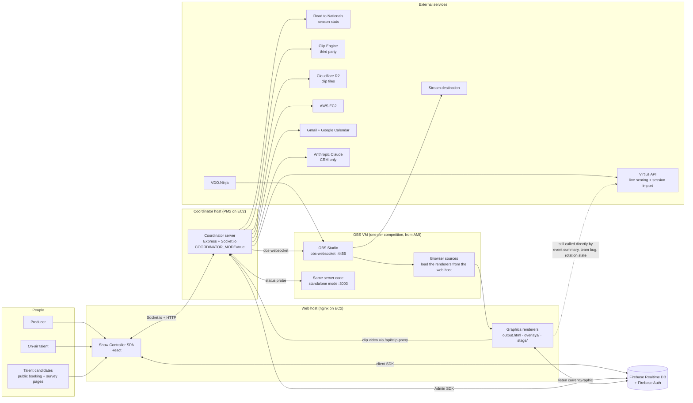
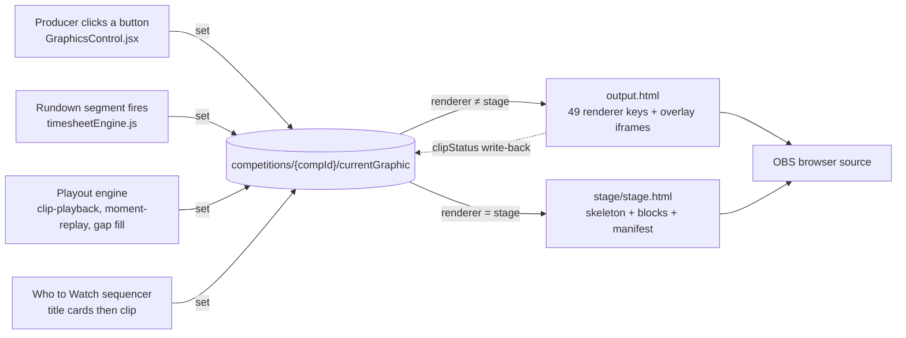
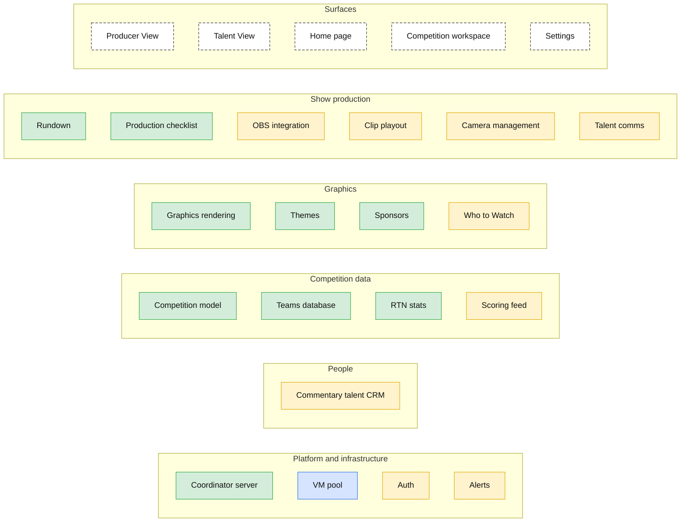
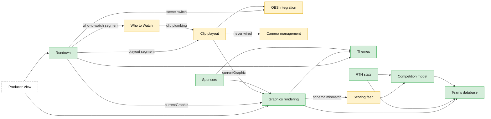

# System Overview — Gymnastics Graphics

**Last updated:** 2026-09-10
**Replaces:** the December 2025 version of this file (dashboard.html / controller.html era; see git history before 2026-09-10).
**Purpose:** a map of every subsystem in this repo, what state each is in, how sport-specific each is, and how they connect. Written to support the decision about building a platform on top of this codebase.

## How to read this document

1. **Summary table** — one row per system: layer, status, sport coupling, one-line purpose. Read this first.
2. **Four diagrams** — the runtime context (who talks to whom at a meet), the single Firebase wire every graphic goes through, the systems by layer colored by status, and the load-bearing dependencies between the core systems.
3. **Surfaces** — the screens people actually open. Producer View is the product; the systems are its features.
4. **System entries** — one fixed-shape entry per system: purpose, status with evidence, files, Firebase paths, socket events, routes, dependencies, gaps.
5. **Firebase data model** — the shared bus. Who owns which path.
6. **Appendix** — tooling, root-folder guide, orphaned and legacy code, where the PRDs are.

**Planning from this document:** [docs/TOOL-INVENTORY.md](docs/TOOL-INVENTORY.md) and [docs/tool-inventory.csv](docs/tool-inventory.csv) turn this map into one row per capability (144 rows), each with the control surface that drives it today, its reliability, and its evidence. Use those when sizing work or deciding what an agent could drive; use this document to understand how the pieces fit.

### Status scale

| Status | Meaning |
|---|---|
| **Proven** | Evidence it ran in a real broadcast (incident write-ups, event audits, live screenshots, event-specific config). |
| **Built** | Complete and wired end to end in code, verified by tests or screenshots, but no evidence of live use. |
| **Partial** | Wired but with known gaps: unfinished phases, PRD known-issues, UI without backend or the reverse, env-gated features never configured. |
| **Orphaned** | Code exists but is not imported, routed, or reachable; or it was superseded. |

Status is judged from the code and from evidence in the repo, **not** from the `Status:` fields in the PRDs, which are stale (several "Not Started" PRDs have shipped code behind them). Corrections from people who ran the shows are welcome and expected.

Events the repo and the live database show evidence of:

- WCGNIC 2026, March 26 and 27 (prelim 1, prelim 2, event finals; theme `behind-the-chalk`)
- MPSF Championships 2026, April 4 (theme `mpsf-championships`)
- Army / Greenville / Springfield men's tri-meet, March 7, 2026 (the checklist was worked that morning)
- Pink Invitational 2026 (theme `pink-meet-2026`)
- A women's seven-team meet audited live on production on March 6, 2026
- Dual and multi-team meets named in bug write-ups: West Chester vs Cortland, William & Mary vs Alaska (March 12 and 14, 2026), a Stanford five-team men's quad
- ECAC 2026: a theme assigned to a real competition, plus a synthetic audit competition used for graphics sweeps (audit-grade, not broadcast-grade)

### Sport-coupling scale

| Coupling | Meaning |
|---|---|
| **Generic** | No sport assumptions in the code. |
| **Sport-parameterized** | Works for another sport by swapping configuration (apparatus list, competition types, scoring format) without changing core logic. |
| **Gymnastics-bound** | Logic tied to the Virtius or Road to Nationals APIs, apparatus codes, rotation formats, olympic order, or gymnastics scoring is hard-coded in. |

### Layers

| Layer | Systems |
|---|---|
| Platform and infrastructure | Coordinator server · VM pool · Auth · Alerts · (Firebase data model) |
| Show production | Rundown · OBS integration · Talent comms · Camera management · Production checklist · Clip playout |
| Graphics | Graphics rendering · Themes · Sponsors · Who to Watch |
| Competition data | Competition model · Teams database · Scoring feed · RTN stats |
| People | Commentary talent CRM |

Two things that used to be candidates for their own boxes are folded in with honest notes: the rule-based "AI" segment-suggestion service lives under **Rundown**, and the rule-based "AI" live-context service lives under **Talent View**. Neither calls a language model. The only language-model calls in the codebase are three endpoints in the **Commentary talent CRM**.

---

---

## Summary table

| System | Layer | Status | Sport coupling | What it does |
|---|---|---|---|---|
| [Coordinator server](#coordinator-server) | Platform | **Proven** | Generic | The one Node process every surface talks to; hosts every server-side system. Action bus (ISA2-272) with guardrails (ISA2-273); competition state service (ISA2-274) feeding typed events; Jev decision service (ISA2-275, TypeSafe, Suggest mode only, never run with a real key). Wake path is dead. |
| [VM pool](#vm-pool) | Platform | **Built** | Generic | EC2 and custom OBS VMs, assigned to competitions. Health monitor never wired. |
| [Auth](#auth) | Platform | **Partial** | Generic | Firebase login in the browser only. The server and the database are unauthenticated. |
| [Alerts](#alerts) | Platform | **Partial** | Generic | Complete service and panel; nothing ever raises an alert. |
| [Rundown](#rundown) | Show production | **Proven** | Gymnastics-bound | Segment editor plus the timesheet engine that runs the show. Rule-based "AI" suggestions folded in. |
| [OBS integration](#obs-integration) | Show production | **Partial** | Sport-parameterized | Browser remote for the VM's OBS. Socket path works; the 65 REST routes bind to a local OBS that never connects. |
| [Talent comms](#talent-comms) | Show production | **Partial** | Generic | VDO.Ninja room and URL generator. The OBS source is still added by hand. |
| [Camera management](#camera-management) | Show production | **Partial** | Sport-parameterized | SRT camera health and fallback. Never ran against real cameras; fallback has no caller. |
| [Production checklist](#production-checklist) | Show production | **Proven** | Gymnastics-bound | 75-item pre-flight list, 14 auto-verified. Used the morning of a real meet. |
| [Clip playout](#clip-playout) | Show production | **Partial** | Gymnastics-bound | Autonomous playout of third-party clips. Deployed for WCGNIC; did not run the meet. LIVE mode unreachable. |
| [Graphics rendering](#graphics-rendering) | Graphics | **Proven** | Gymnastics-bound | `output.html`, 29 overlays, and the new stage engine; 55 registered graphics. Stage engine is Built, not yet Proven. Recording package loader (ISA2-294) for recorded playback. |
| [Themes](#themes) | Graphics | **Proven** | Sport-parameterized | Per-meet branding with per-graphic overrides. 13 real themes. |
| [Sponsors](#sponsors) | Graphics | **Proven** | Sport-parameterized | Team and event sponsor logos in three graphics. Cycle-timing controls are a no-op. |
| [Who to Watch](#who-to-watch) | Graphics | **Partial** | Sport-parameterized | Title cards plus video package played from a rundown segment. No evidence of live use. |
| [Competition model](#competition-model) | Competition data | **Proven** | Gymnastics-bound | The meet record everything hangs off; Virtius import; formats and apparatus. |
| [Teams database](#teams-database) | Competition data | **Proven** | Gymnastics-bound | Logos, rosters, headshots, aliases for 73 teams. Key conventions have drifted. |
| [Scoring feed](#scoring-feed) | Competition data | **Partial** | Gymnastics-bound | Server-side Virtius polling into Firebase. Writer works; the only reader expects a different shape. |
| [RTN stats](#rtn-stats) | Competition data | **Proven** | Gymnastics-bound | Road to Nationals season stats into config and a show-start snapshot. |
| [Commentary talent CRM](#commentary-talent-crm) | People | **Partial** | Sport-parameterized | 482-person roster and per-meet assignment (Proven); outreach, discovery, and survey never exercised. |

**By status:** 9 Proven, 1 Built, 9 Partial. Nothing is wholly Orphaned at the system level, but orphaned sub-parts are called out inside most entries.
**By sport coupling:** 5 Generic, 6 Sport-parameterized, 8 Gymnastics-bound.

## What this means for building a platform on it

1. **The proven core is narrower than the feature list.** What has actually carried real broadcasts is: the coordinator, the competition model, the teams database, RTN stats, the legacy graphics renderers with themes and sponsors, the rundown editor with the timesheet engine, and the production checklist. That is the foundation. The stage engine, VM pool, and OBS remote are complete and exercised against test competitions but have not run a show.
2. **Three systems look finished and are not load-bearing yet.** Clip playout was deployed for WCGNIC 2026 and its own heartbeat shows it never ran the meet; its LIVE mode is unreachable and its rules block is dead config. The scoring feed writes leaderboards nobody can read because the stage block expects a `rows` envelope that was specified and never implemented. Camera management never touched a real camera and its automatic fallback has no caller.
3. **The generic layer is thinner than it looks.** Only five systems have no sport assumptions, and two of those (alerts, talent comms) barely function. The sport-parameterized six (OBS, camera, themes, sponsors, Who to Watch, CRM) would carry over to another sport by swapping configuration. The eight gymnastics-bound systems share one root: the competition model's apparatus, format, and Virtius/RTN coupling, with duplicated tables inside `output.html`. The Competition model entry lists exactly what a sport-parameterized refactor would touch.
4. **Cross-cutting risks a platform would inherit.** No server-side authentication of any kind, and no versioned database rules. The coordinator can put itself to sleep and cannot wake up, which currently blocks the VM Pool page. Two show engines can drive OBS at once through Talent View. Team keys are derived differently in different places and have already corrupted live data. `server/index.js` is 8,730 lines with 82 routes and 117 socket handlers in one file. Name normalization, theme resolution, and apparatus tables each exist in three to five hand-synchronized copies.
5. **The PRDs are not a status source.** Their `Status:` fields are wrong in both directions: "Not Started" on shipped systems (Sponsors, Clip Integration) and "not started" on completed phases (Theme V2 Phase 7). The `implementation-plan.md` and `plan.md` files inside each PRD folder are accurate; the top-level status lines are not.
6. **The "AI" in the system is heuristics.** The two large AI services are rule engines. The only language-model calls are three CRM endpoints (note parsing, screenshot parsing, discovery scoring), all gated on an API key with no evidence it was ever set.

## Diagram 1: runtime context at a meet

Solid edges are wired and working. Dashed edges are paths that exist but bypass the intended design. Note that the coordinator connects to OBS on the VM directly; the VM's own copy of the server is only probed for status.

## Diagram 2: the one wire that matters most

Every on-air graphic goes through one Firebase node. Four writers, two readers, and each reader ignores payloads meant for the other.

## Diagram 3: the systems by layer and status

Green is Proven, blue is Built, amber is Partial. Dashed boxes are surfaces, which compose systems rather than being one. Every server-side system runs inside the Coordinator server process.

## Diagram 4: how the core systems depend on each other

Only the load-bearing dependencies between the systems that carry a show. Arrows point from the system that depends to the system it needs. Dashed arrows are dependencies that exist in code but do not function. Platform systems are omitted: everything server-side runs inside the coordinator, and the OBS integration reaches its VM through the VM pool.

---

## Surfaces: the screens people open

Producer View is the product. The systems above are its features. Talent View is deliberately a subset of the same tools. The other three surfaces exist to get a competition ready for those two.

| Surface | Route | What it composes | Status |
|---|---|---|---|
| **Home page** | `/` (`/hub`, `/dashboard`, `/select` redirect here) | Competition list with readiness badges (VM, RTN stats, commentary, scoring feed), create/edit modal with Virtius import and theme picker, VM assign/release, pre-production alerts, links to every management tool and admin page | Partial |
| **Competition workspace** | `/:compId/*` | The per-meet shell: resolves config and socket URL, mounts the Show and OBS providers, one nested tab: `producer`, `talent`, `rundown`, `obs-manager`, `checklist`, `commentary`, `camera-setup`, `graphics` | Partial |
| **Producer View** | `/:compId/producer` | Rundown transport and now/next, scene and camera override, audio cue, Web Graphics panel, alerts and theme errors, scoring feed and score bug, the full clip-playout panel stack, VM credentials, AI talking points, Jev recommendation widget (take, dismiss, Off/Suggest toggle; ISA2-276, Built, never shown with a real key) | Proven |
| **Talent View** | `/:compId/talent` (no login required) | On-camera banner, current segment and script, next segment, large previous/pause/next transport, quick-action graphics, read-only run of show, clip NOW / NEXT with flag-moment | Partial |
| **Settings** | `/settings` | One thing: bulk import of the annual commentator survey CSV into the talent roster | Partial |

**Home page.** Everything on it is real and wired. The coordinator status badge used to call the dead Netlify functions and always showed "sleeping", which also kept the VM Pool page locked. That was fixed 2026-09-27 (ISA2-47): it now reads `/api/coordinator/status`. Nothing on Home links to `/talent` or `/settings`; the talent roster is reached through the Commentary tab or the global Cmd+K palette, and Settings is reachable only by typing the URL.

**Competition workspace.** There is no tab bar. Navigation between tabs happens through the link row inside Producer View and the Home page card. Two tabs are broken as tabs: `graphics` (the "Meet Setup" page reads `?comp=` from the query string instead of the route param, so it renders "No competition ID specified"; nothing links to it) and `talent` (same defect, see below). Only the checklist tab has an error boundary; a render error in Producer View, Talent View, the rundown editor, or the theme editor white-screens the app.

**Producer View.** Verified on production against WCGNIC 2026 prelim 1 on 2026-03-23, and the target of four live-incident fixes. Two partial areas. First, clip playout has no producer-facing start button: `startPlayout` exists in the actions hook and nothing calls it, so the playout panels appear only when a rundown segment of type `playout` fires. Second, the scene dropdown fetches `/api/scenes` relative to the SPA host and gets HTML back, so only the eight hard-coded scene buttons work. The keyboard shortcuts are enabled only while playout is active.

**Talent View.** Three defects. It reads `compId` from `?comp=`, so at its real route the Firebase talent roster never loads and the view always shows placeholder names. Its "Ready to Start" gate uses the legacy engine's `isPlaying`, which the timesheet engine never sets, so when the producer starts the show correctly Talent View stays on "Ready to Start"; if the commentator presses that button, the legacy `startShow` handler fires a second engine that switches OBS scenes and broadcasts graphics globally. This is the live remnant of the "dual control systems" issue in `ROADMAP.md`; the right-hand timesheet panel that issue describes is gone, and Producer View now drives the timesheet engine only. Third, the clip info panel ships hard-coded placeholder talking points.

**Sub-part folded into Talent View: AI context (Partial, close to Orphaned in practice).** `server/lib/aiContextService.js` (2,834 lines, the largest server file) generates per-segment talking points and milestone callouts. It calls no language model; its only outbound request is to Virtius, and the rest is deterministic templating over live scores and the frozen RTN snapshot. The socket wiring is complete end to end: the service starts on `showStarted`, emits `aiContextUpdated` on segment transitions, and both views listen. But the panel in both views is gated on a flag that only an inbound update sets, neither view ever requests context on mount, the "Milestones and Records" block reads a list nothing ever fills, the achievements event has no listener, and the competition room is never joined in local mode, so the panel cannot appear in local dev at all. The file's own section header still says "Stubs - to be implemented in Task 59." The owner's recollection that AI was attempted and not finished is accurate.

**Settings.** The importer is complete and self-contained. It contains none of the things the name suggests: themes live at `/theme-editor`, graphics at `/graphics-manager`, VMs at `/_admin/vm-pool`, and sign-out is a floating chip on every protected page.

**Shared shell.** `AuthProvider` is the only global provider; `CompetitionProvider`, `ShowProvider` (the socket), and `OBSProvider` are scoped to `/:compId`. `RequireAuth` wraps sixteen top-level routes. `CoordinatorGate` wraps one route (`/_admin/vm-pool`) and opens when `/api/coordinator/status` reports the coordinator online. The global Cmd+K `CommandPalette` searches the talent roster and the competition index. Full detail: [docs/system-map/surfaces.md](docs/system-map/surfaces.md).

---

## System entries

One entry per system. Each links to its full survey entry under `docs/system-map/`, which carries the complete file list, every Firebase path, every socket event and route, and the full known-gaps list.

<!-- Platform and infrastructure -->

### Coordinator server

**Layer:** Platform and infrastructure · **Status: Proven** · **Sport coupling: Generic**

One Node process (`server/index.js`, 8,730 lines) that every producer surface talks to. It holds the Firebase Admin credential, fans state out over Socket.io rooms, and proxies control to per-competition OBS VMs. Each competition runs an action bus (one command path for scene and graphic actions with acks), guardrails (four enforcement rules: minShotHoldMs, noCutDuringRoutine, noGraphicStacking, cameraMustHaveSignal), and a competition state service (polls Virtius or a recorded log, reduces it to typed events athleteUp/greenLight/routineEnded/scorePosted/scoreCorrected/rotationChanged/teamTotalChanged with confidence and evidence). The same code runs as the central coordinator (`COORDINATOR_MODE=true`, PM2 name `coordinator`) and standalone on each OBS VM (PM2 name `virtius-server`); the mode flag only gates auto-shutdown and a status string, so a standalone VM boots the whole coordinator API too.

- **Where:** `server/index.js` (82 HTTP routes, 117 socket handlers, 124 emitted event names, plus 65 OBS routes mounted from `server/routes/obs.js`), `server/lib/autoShutdown.js`, `server/lib/selfStop.js`, `server/lib/actionBus.js`, `server/lib/guardrails.js`, `server/lib/competitionState/*.js`, `server/ecosystem.config.js`, `show-controller/src/hooks/useCoordinator.js`, `CoordinatorGate.jsx`, `SystemOfflinePage.jsx`.
- **Owns in Firebase:** `coordinator/shutdownHistory/{pushId}`.
- **Talks to:** Firebase Admin SDK, AWS EC2 (self-stop, status), PM2, nginx.
- **Depends on:** nothing above it. Hosts every other server-side system by direct import.
- **Used by:** every surface (Socket.io via `ShowContext`, HTTP via `serverUrl.js`), Production checklist (`socket-connected` validator), Graphics rendering (serves `output.html`, `overlays/`, `stage/` as static files).
- **Evidence:** BUG-021 in `docs/PRD-Rundown-System/BUGS.md` is a 2026-03-07 pre-show incident on this process; production IPs and runbooks in `docs/INFRASTRUCTURE.md`; deploy-and-verify commits naming WCGNIC data.
- **Top gaps:**
  - **Wake/sleep is one-directional.** Sleep works (`autoShutdown` → `selfStop` → EC2 stop). Wake does not, and cannot from a browser. *Updated 2026-09-27 (ISA2-47):* `useCoordinator` now checks the real `/api/coordinator/status` instead of the dead `/.netlify/functions/*`, so the status badge is accurate and `CoordinatorGate` opens. "Start System" became "Check Again" (re-check plus 2-minute poll). A stopped server is started from AWS. Production runs without `COORDINATOR_MODE`, so auto-sleep is off. The `/.netlify/functions/*` redirect shims in `server/index.js` are now unused.
  - **`/health` does not exist.** `CLAUDE.md` and `SPINUP-2026-08-17.md` both say to curl it; the SPA catch-all returns `index.html` for it, so the documented smoke test always passes.
  - **No server-side auth at all** and `express.static` serves the whole deploy root, which on the production layout would have included `firebase-service-account.json`. See Auth.
  - Port disagreement (3001 in `ecosystem.config.js` and `docs/INFRASTRUCTURE.md`, 3003 everywhere else); PM2 `wait_ready` configured but `process.send('ready')` never called; no SIGTERM handler; shutdown-warning socket events have no client listener.
  - `configLoader.setActiveCompetition()` is process-global and set on every socket connect, so REST routes that read "the active competition" serve whichever client connected last.
- Full entry: [docs/system-map/coordinator-server.md](docs/system-map/coordinator-server.md)

### VM pool

**Layer:** Platform and infrastructure · **Status: Built** · **Sport coupling: Generic**

A registry of OBS-ready machines, either EC2 instances launched from a prebuilt AMI or manually registered "custom" VMs, that an admin can start, stop, and assign to a competition. Assignment writes `vmAddress` (and credentials for custom VMs) into the competition config so the coordinator can route OBS control to the right machine.

- **Where:** `server/lib/vmPoolManager.js`, `server/lib/awsService.js`, `show-controller/src/pages/VMPoolPage.jsx`, `VMCard.jsx`, `hooks/useVMPool.js`, `vm-full-setup.sh`, `docs/vm-setup-guide.md`.
- **Owns in Firebase:** `vmPool/config`, `vmPool/vms/{vmId}`, `competitions/{compId}/config/vmAddress`, `competitions/{compId}/config/vmCredentials`.
- **Talks to:** AWS EC2 (describe, start, stop, terminate, RunInstances from AMI `ami-070ce58462b2b9213`), the VM's own `GET :3003/api/status`.
- **Depends on:** Coordinator server (hosts it), Competition model (assignment target), Auth (client-side route guard only).
- **Used by:** OBS integration (coordinator looks up `vm.publicIp` on socket connect; it reads the pool's in-memory cache, not `config/vmAddress`, which contradicts `docs/README-OBS-Architecture.md`), Home page (VM dot + assign/release), Producer View (VM Connection panel), Production checklist (`vm-assigned`, `vm-online`), Competition workspace header.
- **Evidence:** real instance launched, stopped, started, and assigned against production on 2026-01-17 (`ralph-vmpool/activity.md`); AMIs still exist in AWS. No evidence of the pool being operated during a named broadcast.
- **Top gaps:**
  - `server/lib/vmHealthMonitor.js` (773 lines) is imported by nothing. No recurring health check runs; the only probe is a one-shot 120-second wait after `startVM`.
  - Warm-pool automation (`ensureMinWarmVMs`, `markVMInUse`, `updateVMServices`, `setVMError`) is defined and never called; `warmCount`, `coldCount`, `maxInstances`, `idleTimeoutMinutes` are display-only.
  - The 15 VM socket events and 5 socket handlers have no client consumer; the UI uses REST plus Firebase.
  - Service dots on the VM card read `services.node/obs/nomachine` but the only writer produces `nodeServer/obsConnected`, so they are permanently grey.
  - No auth on any VM route; `GET /api/admin/vm-pool` returns custom-VM plaintext passwords to any caller.
  - `assignedTo` is a string for AWS VMs and an array for custom VMs; `stopVM` and `_mapEC2StateToStatus` miss the array branch.
- Full entry: [docs/system-map/vm-pool.md](docs/system-map/vm-pool.md)

### Auth

**Layer:** Platform and infrastructure · **Status: Partial** · **Sport coupling: Generic**

Firebase email/password login in front of the show controller. Sixteen top-level routes and every `/:compId/*` route except `/:compId/talent` are wrapped in a client-side guard. The public booking and survey pages are deliberately open.

- **Where:** `show-controller/src/context/AuthContext.jsx`, `pages/LoginPage.jsx`, `components/RequireAuth.jsx`, `components/CompetitionLayout.jsx`, `lib/firebase.js`.
- **Owns in Firebase:** nothing. Identity lives in Firebase Auth; accounts are created by hand in the Firebase Console.
- **Depends on:** Firebase Authentication only.
- **Used by:** every protected surface.
- **Evidence:** ten Playwright captures against the production domain on 2026-03-11 in `docs/PRD-Auth-Login/screenshots/`.
- **Top gaps:**
  - **The coordinator is entirely unauthenticated.** All 82 HTTP routes and all socket events accept any caller; `io` is created with `cors.origin: "*"`; there is no `verifyIdToken`, no `io.use()`, no middleware beyond `cors()` and `express.json()`.
  - No Realtime Database rules are in the repo (no `database.rules.json`, no `firebase.json`). The only documented rules are the December 2025 open rules. The client Firebase config is hard-coded in `firebase.js`, so RTDB rules are the only real perimeter, and they are unversioned.
  - The PRD claims `talentRoster` and `surveyResponses` rules require `auth != null`, but the public booking and survey pages write those paths while signed out. Either the rules are open or those pages are broken.
  - No roles, no allowlist, no audit trail; `user.uid` is never recorded on any write.
- Full entry: [docs/system-map/auth.md](docs/system-map/auth.md)

### Alerts

**Layer:** Platform and infrastructure · **Status: Partial** · **Sport coupling: Generic**

A server-side alert service (levels, categories, acknowledge, auto-resolve) with a Producer View banner and panel. Complete on both ends, but nothing in the running system ever creates an alert.

- **Where:** `server/lib/alertService.js`, eight `/api/alerts/*` routes in `server/index.js`, `show-controller/src/hooks/useAlerts.js`, `components/AlertPanel.jsx`. A separate client-only mechanism, `hooks/useProductionAlerts.js`, derives pre-production alerts from CRM booking state for the Home page.
- **Owns in Firebase:** `alerts/{compId}/{alertId}`. The live database has no `alerts` node at all; zero alerts have ever been written.
- **Depends on:** VM pool via the orphaned health monitor (the only `createAlert` caller, never imported), Competition model (scoping), Commentary talent CRM (for the pre-production variant).
- **Used by:** Producer View (banner + panel), Home page (pre-production list).
- **Evidence:** none for the alert service. The parallel theme-error log (`competitions/{compId}/production/themeErrors`, written by `overlays/theme-loader.js`, shown by `ThemeErrorLog.jsx`) did run live: three real entries from WCGNIC 2026 prelim 1.
- **Top gaps:**
  - No producer of alerts is wired. Three of five categories (`SERVICE`, `CAMERA`, `TALENT`) have zero call sites anywhere.
  - Socket broadcasting is a stub: `acknowledgeAlert` echoes without touching the service; the service's own events have no listener.
  - None of the eight HTTP routes are called by the SPA; the client acknowledges by writing Firebase directly with `acknowledgedBy: 'producer'`.
  - `useProductionAlerts` checks `preProductionMeetingScheduled` at the competition root while the server writes it under `commentary/{talentId}`, so that alert can never clear.
- Full entry: [docs/system-map/alerts.md](docs/system-map/alerts.md)

<!-- Show production -->

### Rundown

**Layer:** Show production · **Status: Proven** · **Sport coupling: Gymnastics-bound**

The producer plans a broadcast as an ordered list of timed segments (OBS scene, graphic, audio cue, talent, equipment, sponsor), saves it per competition or as a template, then runs it live. The server-side timesheet engine ticks the clock, auto- or manually advances, switches the OBS scene, fires the graphic to `currentGraphic`, starts clip playout for `playout` segments, and records every override and actual segment duration.

- **Where:** `show-controller/src/pages/RundownEditorPage.jsx` (12,193 lines, the entire editor), `server/lib/timesheetEngine.js`, `server/lib/segmentMapper.js`, `server/lib/productionConfigService.js`, `show-controller/src/context/ShowContext.jsx`, `hooks/useTimesheet.js`, `components/{RunOfShow,CurrentSegment,NextSegment,OverrideLog,QuickActions}.jsx`.
- **Owns in Firebase:** `competitions/{compId}/rundown/{segments,groups,approvalStatus,timezoneConfig,history,presence}`, `competitions/{compId}/production/rundown/analytics/{runId}`, `rundownTemplates/{id}`, `segmentTemplates/{id}`, and writes `competitions/{compId}/currentGraphic` when a segment fires a graphic.
- **Wires:** 30 `timesheet*` socket events out, 16 control events in (`loadRundown`, `startTimesheetShow`, `advanceSegment`, ...). The `/api/timesheet/*` HTTP routes target a legacy global engine, not the per-competition engines.
- **Depends on:** OBS integration (scene switch, media sources), Graphics rendering (`currentGraphic` + `stage/graphics-registry.json`), Themes (`resolveTheme()`), Sponsors (inlines team sponsors for `sponsors-*` segments), Clip playout (`playoutStarted`/`playoutStopped`), Who to Watch (sequencer), Competition model, Teams database, RTN stats.
- **Used by:** Producer View, Talent View, Production checklist (three rundown validators), Clip playout, Who to Watch.
- **Evidence:** 28 real run records under `competitions/wcgnic-2026-prelim1/production/rundown/analytics/` (37 segments, non-rehearsal, mixed auto and manual advances); 12 saved templates named for real meets; 11 live-incident bugs in `docs/PRD-Rundown-System/BUGS.md`.
- **Sub-part, AI segment suggestions (Partial):** `server/lib/aiSuggestionService.js` (1,848 lines) is a deterministic rule engine, not a language model. It has no Anthropic, OpenAI, or HTTP import; it templates pre-show, team-intro, per-apparatus rotation, post-show, and special segments and scores them with fixed confidence bonuses. It is reachable from the editor's AI Suggestions toolbar over the `getAISuggestions` socket event and did run on real data (screenshot for competition `8kyf0rnl`). Two of its four data sources, `teamsDatabase/honors` and `teamsDatabase/milestones`, do not exist in Firebase, so the All-American, record-holder, and milestone suggestion types can never fire. The owner's recollection that "AI didn't fully get done" is accurate: what shipped is a heuristic generator running on a third of its intended inputs.
- **Top gaps:**
  - `timingMode: 'follows-previous'` is silently downgraded to manual by `segmentMapper.js`; such segments hang until the producer advances.
  - `content-sequence` is offered as a segment type but the engine has no case for it; sequences only run inside clip playout at a rotation break.
  - `engine.overrideScene()` and `overrideCamera()` always fail for per-competition engines because `getOrCreateEngine()` never passes an `obs` handle. The working override path is the separate legacy handler.
  - Audio cues set the media source's file and restart it; `inPoint`/`outPoint` are discarded.
  - `production/rundown` is a dead second home for rundowns; the editor and `loadRundown` use `rundown/segments`.
  - Multi-competition execution was never tested. No automated tests for the engine or mapper.
- Full entry: [docs/system-map/rundown.md](docs/system-map/rundown.md)

### OBS integration

**Layer:** Show production · **Status: Partial** · **Sport coupling: Sport-parameterized**

A browser-based OBS Studio remote for the competition's VM: scenes, sources, audio with VU meters, transitions and stingers, stream and recording, assets, saved scene-collection templates, program preview, and studio mode. Eight tabs in the OBS Manager page.

- **Where:** `server/lib/obsConnectionManager.js` (one obs-websocket connection per competition, heartbeat, reconnect), `server/lib/obsStateSync.js` (local-dev only), `server/routes/obs.js` (65 REST routes), 53 `obs:*` socket handlers and `broadcastOBSState()` in `server/index.js`, `server/lib/obs{Template,Scene,Source,Audio,Transition,Stream,Asset}Manager.js`, `obsSceneGenerator.js`, `show-controller/src/context/OBSContext.jsx`, `pages/OBSManager.jsx`, `components/obs/*`.
- **Owns in Firebase:** `competitions/{compId}/obs/{state,templateScenes,presets,assets,streamConfig}`, `templates/obs/{templateId}`.
- **Talks to:** obs-websocket on the VM (`ws://{publicIp}:4455`, auth disabled on the shipped AMI), VDO.Ninja URLs injected into templates.
- **Depends on:** VM pool (which IP to connect to), Coordinator server, Competition model (meet type for template auto-load), Talent comms (view URLs for talent browser sources), Graphics rendering (browser-source URLs in templates).
- **Used by:** Rundown (`_applyTransitionAndSwitchScene`, media sources for video and audio cues), Producer View (`overrideScene`, link to the manager), Production checklist (`obs-connected`), Camera management (`GET /api/scenes/preview`).
- **Evidence:** connected to a real VM's OBS with ten template scenes, studio mode, and VU meters (screenshots in `docs/PRD-OBS-11-AdvancedFeatures/`); heartbeat fix verified on production 2026-01-20. The competition used for all of it, `8kyf0rnl` "Simpson vs UW-Whitewater", is a test competition. No evidence OBS control was used during a named broadcast.
- **Per-area status:** StateSync Partial (local-dev path only; production uses a parallel `broadcastOBSState()`). Scenes, Sources, Audio, Transitions, Preview, Advanced: Built over sockets. Stream and Recording: Built, never tested with a real stream key. Assets: Partial (REST layer resolves the competition from a process-global "active competition" and writes files to the coordinator's disk, not the VM). Templates: Partial (last recorded production apply: 9 scenes, 0 inputs created, 12 items skipped). Talent Comms: Partial (own entry).
- **Top gaps:**
  - All 65 REST routes bind to the single global `obs` handle for `localhost:4455`, which on the coordinator is never connected. Only ten of them are called by the SPA (templates, assets, talent comms). The real control plane is the socket layer.
  - The Rundown engine's scene override is broken in multi-competition mode (see Rundown); the Producer View `overrideScene` handler routes to the legacy local handle and is a no-op on the coordinator.
  - `docs/PRD-OBS-00-Index.md` is stale (lists 08.1 as broken and 11 as not started; both completed).
  - The coordinator retries `ws://localhost:4455` every 30 seconds forever because `connectToOBS()` is not gated by mode.
- Full entry: [docs/system-map/obs-integration.md](docs/system-map/obs-integration.md)

### Talent comms

**Layer:** Show production · **Status: Partial** · **Sport coupling: Generic**

Mints a private VDO.Ninja room per competition and gives the producer copy-paste links: join links for two commentators, a director link, and OBS view links. Discord is a stored placeholder with four null fields and no code.

- **Where:** `server/lib/talentCommsManager.js`, six routes in `server/routes/obs.js`, `show-controller/src/components/obs/TalentCommsPanel.jsx`, `server/__tests__/talentCommsManager.test.js`.
- **Owns in Firebase:** `competitions/{compId}/config/talentComms`.
- **Depends on:** Coordinator server, Competition model, OBS integration (the panel and routes are gated on OBS being connected even though the feature only touches Firebase).
- **Used by:** OBS integration only, at template-apply time, to fill `{{talentComms.talent1Url}}` and `talent2Url` browser sources. Talent View does not consume these URLs.
- **Evidence:** panel screenshots; a written-up production failure in `docs/README-OBS-Architecture.md` where templates wired the push URL instead of the view URL, leaving talent video blank. Nothing ties it to a named broadcast.
- **Top gaps:**
  - The PRD's core requirement, auto-creating the VDO.Ninja browser source on the VM's OBS, is marked deferred and was never built; the producer adds it by hand.
  - Hard-coded to exactly two talent slots. Room password is embedded in plaintext in every stored URL; regenerating invalidates links already sent.
  - Connection status comes from a hidden iframe in one producer's browser and is never persisted.
- Full entry: [docs/system-map/talent-comms.md](docs/system-map/talent-comms.md)

### Camera management

**Layer:** Show production · **Status: Partial** · **Sport coupling: Sport-parameterized**

Declares the venue's SRT camera feeds (port, apparatus coverage, fallback partner), polls a Nimble Streamer stats API for per-feed health, lets the producer verify or re-point a camera to a different apparatus mid-show, and is meant to switch OBS to a fallback scene when a feed dies.

- **Where:** `server/lib/cameraHealth.js`, `cameraFallback.js`, `cameraRuntimeState.js` (all last committed 2026-01-13), `server/config/show-config.json` (the only camera config that reaches the monitor), `show-controller/src/pages/CameraSetupPage.jsx`, `components/CameraRuntimePanel.jsx`.
- **Owns in Firebase:** `competitions/{compId}/production/cameras` in theory. The path does not exist for any of the 56 competitions in the live database; the setup page saves to the server's local `show-config.json` instead.
- **Talks to:** Nimble Streamer `GET /manage/srt_receiver_stats` at `nimble.local:8086`, an mDNS name that resolves nowhere. Nothing installs Nimble on the VM AMI.
- **Depends on:** OBS integration (fallback uses the legacy global `switchScene`, so it could never target a per-competition VM), Competition model.
- **Used by:** Producer View (`CameraRuntimePanel`, only when clip playout is not active), Rundown (`overrideCamera` reads the local camera list, ignores health), Competition workspace (`/:compId/camera-setup`).
- **Evidence:** none. No `production/cameras` node in Firebase, no camera references in any event folder, demo config with a port that contradicts the docs.
- **Top gaps:**
  - The health monitor is started at boot and fails every 2 seconds against a non-existent host; the error is swallowed and all cameras sit at `offline`.
  - `handleCameraFailure()` has no caller, so automatic fallback and BRB-on-total-failure never fire.
  - Clip playout keeps its own hard-coded camera table and never reads this system, so its LIVE mode is unreachable.
  - `useCameraHealth.js` and `useCameraRuntime.js` are imported by nothing. Field-name mismatches between server events and client handlers.
  - This looks like a January 2026 build-out superseded by the March clip-playout path and left in place.
- Full entry: [docs/system-map/camera-management.md](docs/system-map/camera-management.md)

### Production checklist

**Layer:** Show production · **Status: Proven** (Phase 1) · **Sport coupling: Gymnastics-bound**

A per-competition pre-flight page with 75 tasks in four timeline phases (5+ days out, 2 to 4 days out, 2 hours before, 1 hour before). Fourteen technical items are auto-verified from live system state; the rest are manual checkboxes with notes. A team-contacts rolodex sits beside it.

- **Where:** `show-controller/src/pages/ChecklistPage.jsx`, `hooks/useProductionChecklist.js`, `lib/checklistItems.js` (the 75-item catalog), `lib/checklistValidators.js` (the 14 validators), `components/TeamContactsPanel.jsx`. No server-side component.
- **Owns in Firebase:** `competitions/{compId}/checklist/{items,notes,lastUpdated}`, `teamsDatabase/contacts/{teamKey}/{roleId}`.
- **Auto-verified items:** event name, meet date, venue, teams configured, theme configured, rosters loaded, headshots at 80 percent, VM assigned, VM online (30-second poll), socket connected, OBS connected, rundown created, segments named, graphics assigned to 80 percent of segments. No scoring-feed or RTN validator.
- **Depends on:** Competition model, Rundown (`rundown/segments`), VM pool (`/api/vm/{compId}/status`), Coordinator server (socket state), OBS integration (`obsConnected`), Teams database (contacts), Themes.
- **Used by:** navigation links only. Nothing reads checklist completion: no alert, no go-live gate.
- **Evidence:** `competitions/cpv7ngyc/checklist` has 41 items checked between 14:39 and 16:57 UTC on 2026-03-07, the day of the Army / Greenville / Springfield men's tri at the Gross Center; a lighter use for Pink Invitational 2026.
- **Top gaps:**
  - Phase 2 (per-type templates) and Phase 3 (venue database, camera positions, site evaluations) are not started; the item list is a static constant shown identically for every competition type.
  - Contacts are 100 percent manual; the single record in Firebase is test data. No import from `team{N}Coaches` or the CRM.
  - Three validators (`socket-connected`, `obs-connected`, `vm-online`) count as errors until the show is running, so the headline percentage is unreachable pre-show.
  - Latent race in `toggleItem` on rapid clicks; the page renders a second header under the workspace header.
- Full entry: [docs/system-map/production-checklist.md](docs/system-map/production-checklist.md)

### Clip playout

**Layer:** Show production · **Status: Partial** · **Sport coupling: Gymnastics-bound**

Ingests routine clips from a third-party Clip Engine and plays them out autonomously during a broadcast: a self-advancing queue, a NOW / NEXT mode readout, skip and force-camera overrides, moment-replay flagging, and gap-fill graphics between rotations, all started by a `playout` segment in the rundown.

- **Where:** `server/lib/playoutEngine.js` (1,913 lines: mode state machine, priority stack, queue, heartbeat, Virtius rotation polling), `server/lib/clipService.js`, the `playoutStarted` bridge and 15 `playout:*` socket handlers in `server/index.js`, `output.html?mode=clip` (dual-video player with write-back), `show-controller/src/components/playout/*`, `hooks/usePlayoutState.js`, `usePlayoutActions.js`, `useKeyboardShortcuts.js`.
- **Owns in Firebase:** `competitions/{compId}/production/{playoutState,clipQueue,engineHeartbeat,clipStatus/{draftId}}`, and `currentGraphic` for `clip-playback`, `moment-replay`, `live-camera`, `fallback`, `rotation-break`, and content-sequence items.
- **Talks to:** Clip Engine REST (`{base}/clip-api/meets/{sessionKey}/deliveries`, third party, default base URL is a personal ngrok tunnel), Cloudflare R2 presigned MP4s via `/api/clip-proxy`, Virtius (rotation inference every 45 seconds).
- **Depends on:** Rundown (the only way the engine starts in practice), OBS integration (scene switch on mode change), Graphics rendering (`output.html` renders the overlay), Themes (`meetTheme` on every write), Teams database (logo aliases), Competition model (`virtiusSessionId`, `clipApiUrl`).
- **Used by:** Producer View (panel stack swaps in when playout is active), Talent View (`TalentClipInfo`, flag moment), Rundown editor (`PlayoutRulesEditor`, `ContentSequenceEditor`), Who to Watch (reuses the clip-playback plumbing and proxy).
- **Evidence:** deployed and verified on production against `wcgnic-2026-prelim1/producer` on 2026-03-23; the `/api/clip-proxy` codec fix was deployed and verified. **Counter-evidence that it did not run the meet:** the engine's last heartbeat for that competition is `FALLBACK` at 03:17 UTC on 2026-03-27, about fifteen hours before first pixel; the real 37-segment rundown contains zero `playout` segments; every surviving `clipStatus` entry is an error from a 2026-03-26 test; the queue holds two clips still `queued`.
- **Top gaps:**
  - **LIVE mode is unreachable.** `_cameraStates` is initialised and never mutated; the engine does not read Camera management. Only manual force-camera (OVERRIDE) puts a live camera on air.
  - **The `playoutRules` block is dead config.** The editor persists clip order, apparatus priority, transition, crossfade, gap-fill sequence; the server discards everything except `clipApiUrl`.
  - Five of seven gap-fill graphic types (`standings`, `sponsor`, `calendar`, `quad-view`, `highlight-reel`) have no renderer in `output.html`, as do `fallback` and `rotation-break`; they blank the screen.
  - Camera table is hard-wired to four women's apparatus; `forceCamera` rejects cameras above 4, so men's six-apparatus meets are impossible.
  - `production/playoutState` is write-only; restart recovery restores the queue but not mode or override. `usePlayoutSimulation.js` and the module-level engine singleton are orphaned. No tests.
- Full entry: [docs/system-map/clip-playout.md](docs/system-map/clip-playout.md)

<!-- Graphics -->

### Graphics rendering

**Layer:** Graphics · **Status: Proven** (stage engine: Built) · **Sport coupling: Gymnastics-bound**

The browser sources OBS loads to put graphics on air, plus the registry that catalogs them so the producer panel, URL Generator, and rundown all offer the same list. Three renderers: `output.html` (13,780 lines, the legacy monolith with 49 renderer keys), `overlays/*.html` (29 standalone files), and `stage/stage.html` (the current component renderer: skeleton + blocks + manifests). A producer clicks a button and the graphic is on the stream within one Firebase round trip.

- **Where:** `output.html`, `overlays/`, `stage/` (`stage.html`, `skeletons/full-screen-card`, `blocks/{header-bar,leaderboard-table,athlete-grid}.js`, `graphics/*.json`, `graphics-registry.json`), `scripts/buildGraphicsRegistry.js` → `show-controller/src/lib/graphicsRegistry.generated.js`, `lib/urlBuilder.js`, `pages/UrlGeneratorPage.jsx`, `pages/GraphicsManagerPage.jsx`, `components/GraphicsControl.jsx`.
- **Registry:** 55 manifests: 11 `stage` (nine per-apparatus leaderboards, AA, combined AA, team roster), 29 `overlay`, 15 `output`. Per-team expansion turns those into 47 buttons for a women's dual and 81 for a men's six-team meet. Migration to the stage engine is 11 of 55; one of four planned skeletons and four of twelve planned blocks exist.
- **Live trigger path:** `GraphicsControl.sendGraphic()` → `set(competitions/{compId}/currentGraphic, {graphic, renderer, data, ...})`. Both `output.html` and `stage.html` listen to that one node; each ignores payloads for the other renderer, so exactly one is on screen.
- **Reads from Firebase:** `currentGraphic`, `config`, `scoring/leaderboard/{apparatus}` (stage only), `teamsDatabase/{teams,headshots}`, `themes/{id}`. **Writes:** `production/clipStatus`, `production/stageErrors`, `scoreBug/*` (team bug).
- **Still calls Virtius from the browser:** `output.html` event summary, `overlays/team-bug.html`, `overlays/rotation-slate-auto.html`. Only the stage engine follows the "Firebase-first" rule.
- **Depends on:** Themes (`theme-loader.js` in `output.html` and 27 of 29 overlays), Scoring feed (stage leaderboards' only data source), Teams database, Competition model, Sponsors, Who to Watch, Clip playout.
- **Used by:** Producer View (Web Graphics panel), Talent View (Quick Actions), Rundown (engine reads the registry and writes `currentGraphic`), Clip playout, OBS integration (template browser-source URLs), URL Generator and Graphics Manager pages.
- **Evidence:** four bug write-ups from real meets in `docs/PRD-Graphics-Registry/` (a Stanford five-team men's quad by session id, a Greenville / California / Simpson men's tri, Team USA AA), 32 WCGNIC 2026 showcase screenshots, and the ECAC audit sweeps (synthetic competition, audit-grade).
- **Top gaps:**
  - Nine registry `overlay` graphics have no `output.html` renderer key, so their producer-panel button blanks the screen; they only work as direct browser sources.
  - Talent View's leaderboard buttons write a renderer key deleted in Phase 6 and render nothing. `output.html`'s `team-roster` iframes a deleted overlay. OBS template apply hands OBS three overlay files that do not exist.
  - `combined-aa-leaderboard` needs a second Virtius session id that nothing passes and a `COMBINED_AA` path the scoring feed never writes.
  - Graphics Manager has a stale category map and no `stage` filter; `overlays/graphic-ids.json` and `docs/GRAPHICS-INVENTORY.md` are stale snapshots.
  - Generic versus bound: sponsors, stream cards, logos, hosts, coaches, team stats, warm-up, replay, interview card, athlete spotlight, Who to Watch, calendar, animated background, clip player, and all seven `frame-*` layouts contain no sport vocabulary. Leaderboards, event summary, event frame, now-competing, team bug, rotation slates, and the stage roster are gymnastics-bound.
- Full entry: [docs/system-map/graphics-rendering.md](docs/system-map/graphics-rendering.md)

### Themes

**Layer:** Graphics · **Status: Proven** · **Sport coupling: Sport-parameterized**

A producer builds a per-meet look once (eight chrome colors, meet and cause logos, header and body background images, texture, event sponsors), assigns it to a competition with one dropdown, and every graphic picks it up. Per-graphic overrides let one graphic differ (a different header image, a bigger venue font, a hidden logo) without changing the rest.

- **Where:** `overlays/theme-loader.js` (1,677 lines, the runtime: `?meetTheme=` or `?comp=` init, three-second timeout with error write, apply and clear overrides, `?debug=theme` panel), `overlays/theme-overrides.css` (the three-layer cascade), `show-controller/src/pages/ThemeEditorPage.jsx` (7,905 lines), `lib/themeResolver.js` and `server/lib/themeResolver.js` (duplicated logic for the stage path), `stage/stage.html` `applyTheme()`, `components/ThemeErrorLog.jsx`, `pages/BackgroundGeneratorPage.jsx`.
- **Owns in Firebase:** `themes/{themeId}` (13 real themes in the live database), `competitions/{compId}/config/meetTheme`, `competitions/{compId}/production/themeErrors`.
- **Wires:** three `/api/admin/themes*` routes for save, list, delete. No sockets.
- **How a theme reaches each renderer:** `output.html` loads the theme once and applies per-graphic overrides on every `currentGraphic` change. Each overlay iframe loads `theme-loader.js` itself and derives its graphic id from its filename. The stage engine has a separate `applyTheme()` that sets variables on the skeleton element and handles both raw and resolved theme shapes. The playout engine stamps `meetTheme` into every graphic it writes.
- **Depends on:** Coordinator server (saves go through the Admin SDK), Competition model (assignment), Graphics rendering, Clip playout, Rundown, Sponsors.
- **Used by:** every renderer, Producer View (error log), Home page (assignment dropdown), Who to Watch (import from theme), URL Generator.
- **Evidence:** themes assigned to real competitions including WCGNIC 2026 (`behind-the-chalk`), MPSF Championships 2026 (April 4, 2026), ECAC, Pink Meet, and ISLA HBCU; three real theme-load errors from WCGNIC prelim 1 in Firebase; nine field-found bugs fixed during the March rollout.
- **Top gaps:**
  - Warm-up and replay lack the theme-level header-image fallback, so a theme's header image shows on every lower third except those two. MPSF hit this.
  - Leaderboard overrides can never reach the renderer: the editor stores them under a misspelled id (`virtuis-leaderboard`) and the runtime ids are now `leaderboard-fx` and friends. Roster overrides have a similar id mismatch.
  - The stage renderer ignores layout overrides entirely and never loads `theme-overrides.css`; the two resolver copies know a small fraction of the 534 override keys the loader supports.
  - Font families are loaded in `output.html` and two overlays only, so font overrides on the other 26 overlays silently fall back.
  - Two of three error types written by the loader are not recognized by the error log's labels. Errors are only logged when `?comp=` is present.
  - The Background Generator writes nothing and is not part of a theme; it emits a URL for a standalone overlay with no theme support.
  - `/api/admin/themes*` has no auth. The V2 PRD status is stale in the optimistic direction too: it says Phases 7A to 7F and 8B are not started, and the code and plan show all 62 tasks done.
- Full entry: [docs/system-map/themes.md](docs/system-map/themes.md)

### Sponsors

**Layer:** Graphics · **Status: Proven** · **Sport coupling: Sport-parameterized**

Stores sponsor logos per team (regular season) or per championship theme, and puts them on air as a full-screen thank-you grid, a full-screen cycling logo, or a persistent corner bug, with per-logo crop, scale, and offset so mismatched source images render at a consistent size.

- **Where:** `overlays/sponsors-{cycle,thanks,bug}.html`, `show-controller/src/hooks/useTeamsDatabase.js` (sponsor CRUD), `components/SponsorAdjustControls.jsx`, the Sponsors section of `pages/MediaManagerPage.jsx`, the Event Sponsors panel of `pages/ThemeEditorPage.jsx`, `lib/urlBuilder.js`, precedence logic in `components/GraphicsControl.jsx`, rundown hydration in `server/lib/timesheetEngine.js`.
- **Owns in Firebase:** `teamsDatabase/sponsors/{teamKey}/{sponsorKey}`, `themes/{themeId}/sponsors/{index}`.
- **Precedence:** theme-level sponsors win when a theme is active in the manual path; the rundown engine only reads team-level sponsors.
- **Depends on:** Teams database, Themes (storage and CSS variables), Graphics rendering (iframe delivery), Competition model (`team1Key`, `meetTheme`), Rundown.
- **Used by:** Producer View, URL Generator, Media Manager, Theme Editor, Graphics Manager, Rundown (segment trigger and fulfillment report).
- **Evidence:** live sponsor data for West Chester, William & Mary, and the `behind-the-chalk` WCGNIC theme (seven sponsors, Synergy first); BUG-S16 (2026-03-14) is a live rundown-path incident from a team-key mismatch; WCGNIC showcase screenshots.
- **Top gaps:**
  - The URL Generator "Cycle Settings" panel is a no-op on air: `cycleDuration` and `excluded` go onto the URL but `sponsors-cycle.html` never reads them (interval hard-coded at 3 seconds; bug at 10).
  - The rundown engine has no theme-level fallback, so rundown-triggered sponsor graphics ignore championship sponsors.
  - The playout content-sequence `sponsor` item type writes a graphic key `output.html` does not have and never hydrates sponsor data.
  - Theme-level sponsors are a positional array, so URL Generator crop adjustments detach from logos when the theme editor reorders them. SVG logos are unsupported. All three overlays cap at eight sponsors.
  - `docs/PRD-Sponsors/` says "Not Started"; every task through T18 shipped.
- Full entry: [docs/system-map/sponsors.md](docs/system-map/sponsors.md)

### Who to Watch

**Layer:** Graphics · **Status: Partial** · **Sport coupling: Sport-parameterized**

An ESPN-style athlete spotlight package built inside a rundown segment: pick a team and athlete from the roster, write up to three full-screen title cards, attach a highlight video URL, and the server plays the package on air automatically (card, card, card, video with a Who-to-Watch lower third, clear, advance).

- **Where:** `overlays/who-to-watch-title.html` (about 25 URL adjustment params), `overlays/who-to-watch.html` (lower third), `show-controller/src/components/playout/WhoToWatchEditor.jsx` (1,290 lines, mounted by the rundown editor for `who-to-watch` segments), the sequencer in `server/index.js` (driven by the timesheet engine's `whoToWatchStarted` event), the Media Manager athlete gallery.
- **Owns in Firebase:** `competitions/{compId}/rundown/segments/{i}/whoToWatch`, `teamsDatabase/media/{athleteKey}`, and `currentGraphic` writes for each step.
- **Video path:** the clip URL is pasted by hand (R2 presigned or YouTube for the thumbnail). Playback reuses the Clip playout machinery: `clip-playback` graphic with `overlayStyle: 'who-to-watch'`, `production/clipStatus` for completion, `/api/clip-proxy` for CORS. There is no Clip Engine auto-population.
- **Depends on:** Rundown, Coordinator server, Graphics rendering, Clip playout, Themes, Teams database, Competition model, OBS integration (two stacked browser sources are required for the video step to composite).
- **Used by:** Competition workspace (rundown tab), Producer View (plays automatically), Media Manager, Theme Editor, URL Generator.
- **Evidence:** none of live use. The video-playback loop notes the server sequencer "could not be verified live because the coordinator server is offline." All commits are from 2026-03-24 to 2026-03-27 and none name a meet.
- **Top gaps:**
  - The producer-panel buttons `team{N}-who-to-watch` write an id `output.html` has no renderer for, so a manual trigger clears the output instead of showing the card.
  - Theme per-graphic overrides never reach the lower third (the loader derives the id `who-to-watch` from the filename; the CSS reads `--who-to-watch-lower-third-*`). The title card has no theme layout variables at all; theme values only arrive by "Import from Theme" copying them into card fields.
  - The theme picked in the editor is local state and never saved; on air the sequencer reads the competition's `meetTheme`.
  - The URL Generator renders no inputs for athlete name, headline, body, or image, so it emits a title card with no editable text (PRD issue 24, still open).
  - Title-card hold time is hard-coded at five seconds. The clip proxy URL is hard-coded to the torn-down production host. No server tests.
- Full entry: [docs/system-map/who-to-watch.md](docs/system-map/who-to-watch.md)

<!-- Competition data -->

### Competition model

**Layer:** Competition data · **Status: Proven** · **Sport coupling: Gymnastics-bound**

One record per meet: teams, gender, apparatus set, rotation count, venue and date, theme, Virtius session, Clip Engine URL, VM assignment. Created by hand or auto-filled from a Virtius session id, then enriched from Road to Nationals. Everything else hangs off `competitions/{compId}` and reads this config.

- **Where:** `show-controller/src/pages/HomePage.jsx` (the current home: list, create/edit modal, Virtius fetch, theme select, Clip URL, VM assign), `hooks/useCompetitions.js`, `lib/eventConfig.js` (apparatus sets, Olympic order, Virtius API names), `lib/competitionUtils.js`, `lib/graphicButtons.js` (the 14 competition types), `context/CompetitionContext.jsx`, `components/CompetitionLayout.jsx`, `server/lib/apparatusConfig.js`.
- **Owns in Firebase:** `competitions/{compId}/config/*` (full key table in the detailed entry), `competitions/{compId}/teamData`, `competitions/{compId}/compositeTeams`.
- **Talks to:** Virtius (`GET https://api.virti.us/session/{id}/json`, called directly from the browser, not through the existing server proxy), Road to Nationals.
- **Depends on:** Teams database (logo autofill, team keys), RTN stats (`team{N}Ave/High/Con/Nqs` sync honoring `_locks`), VM pool, Coordinator server, Auth, Themes (picker), Alerts (pre-production cards).
- **Used by:** every other system, via `competitions/{compId}/config/*`.
- **Evidence:** `docs/PRD-7-Team-Audit/` audits a real `womens-7` competition live on production (2026-03-06); the WCGNIC 2026 Session 1 composite-team config in `CLAUDE.md`; WCGNIC deploy-and-verify commits.
- **Top gaps:**
  - `pages/DashboardPage.jsx`, `HubPage.jsx`, and `CompetitionSelector.jsx` are imported by nothing; `/dashboard`, `/hub`, `/select` redirect to `/`. `lib/rotationSchedule.js` and `hooks/useRotationSchedule.js` have no importer; `output.html` carries its own duplicate rotation table.
  - `ControllerPage.jsx` ("Meet Setup") is routed at `/:compId/graphics` but reads `?comp=` from the query string, so at that route it shows "No competition ID specified". No UI links to it.
  - `views/ImportView.jsx` is a run-of-show CSV uploader, not Virtius import; its success link goes to a route that now redirects home.
  - No meet-format field (alternating vs head-to-head) is stored; `summaryFormat` is hard-coded per graphic send. `meetDate` is free text with no timezone. `duplicateCompetition` copies only `config`.
  - Team-count support drifts: types go to `womens-10`, but RTN parsing caps at 7 and falls back to 2.
- **What a sport-parameterized refactor would touch:** `lib/eventConfig.js`, `lib/competitionUtils.js`, `lib/graphicButtons.js`, `lib/rotationSchedule.js`, the three apparatus hooks, `server/lib/apparatusConfig.js` and `showConfigSchema.js`, `server/lib/rtnStatsService.js`, and the duplicated tables inside `output.html`. `gender` would become a pointer to a sport definition (apparatus list, order, API name map, rotation policy, score model) and `compType` would split into sport, division, team count, and format.
- Full entry: [docs/system-map/competition-model.md](docs/system-map/competition-model.md)

### Teams database

**Layer:** Competition data · **Status: Proven** · **Sport coupling: Gymnastics-bound**

The shared library of every school the production covers: logo, roster, per-athlete headshot and extra media, team sponsors, and name aliases. A producer sets a team up once in Media Manager, and every graphic and rundown afterwards resolves the right logo and face from a team name typed anywhere.

- **Where:** `show-controller/src/hooks/useTeamsDatabase.js` (925 lines: five live subscriptions plus all CRUD and lookups), `lib/nameNormalization.js`, `pages/MediaManagerPage.jsx` (the only admin UI), the Virtius roster HTML parser in `hooks/useCompetitions.js`. Browser-side lookup indexes are duplicated in `output.html`, `overlays/team-bug.html`, and `stage/blocks/athlete-grid.js`.
- **Owns in Firebase:** `teamsDatabase/{teams,headshots,aliases,media,sponsors}`. Other systems keep their own subtrees here: `stats` (RTN stats) and `contacts` (Production checklist).
- **Live contents:** 73 team records, about 900 real athletes across 1,796 headshot nodes, 120 aliases, 3 sponsor sets, one media entry.
- **Wires:** none. Direct Firebase access from browser and server.
- **Depends on:** Competition model (`buildTeamKey`), Auth, RTN stats (`rtnId` join key).
- **Used by:** Graphics rendering (logos, headshots, roster grid), Sponsors, Rundown (sponsor read-through), Who to Watch (athlete picker, gallery), Clip playout (aliases), Scoring feed (curated logo override), Competition model (logo autofill, `teamData` merge), Home page.
- **Evidence:** a production fix on a real `womens-7` meet flipped `output.html` to prefer curated logos after a college rendered as an American flag; three live bug write-ups trace to team-key splits; the WCGNIC composite team depends on these records.
- **Top gaps:**
  - **Two incompatible headshot key conventions in the same node.** Every headshot writer keys by normalized name with spaces (`"ben aguilar"`), but the competition enrichment path writes `rtnId` under an underscore key (`ben_aguilar`). Firebase holds both for most athletes, and the Media Manager "RTN" badge is dead for anyone whose id came from enrichment. A third, hyphenated format exists for a few athletes written out of band.
  - The suffix stripper's regex eats trailing letters of ordinary surnames (`Toscanini` becomes `toscanin`, `Popov` becomes `popo`). Visible in live keys.
  - Five records for two William & Mary teams (`&`, `and`, and stripped variants), plus duplicate pairs for Cal, RIC, TWU, Alaska, Southern Connecticut. The hook exposes no delete-team and no alias CRUD, so nothing in the UI can merge them.
  - Enrichment creates stub team records containing only `rtnId`. The `league` field (NCAA vs GymACT) is read by the server and written by nothing.
  - Four hand-synchronized copies of the name normalizer, plus a fifth in a one-off script that omits suffix stripping. `DATA-ARCHITECTURE.md` names a static fallback file that no longer exists.
- Full entry: [docs/system-map/teams-database.md](docs/system-map/teams-database.md)

### Scoring feed

**Layer:** Competition data · **Status: Partial** · **Sport coupling: Gymnastics-bound**

Server-side polling of the Virtius live-scoring API that publishes graphic-ready leaderboards, team totals, and rotation state into Firebase, so live score graphics stop hammering the API from every browser source. Producers toggle the feed and its interval from the competition card or the Producer sidebar.

- **Where:** `server/lib/scoringIngestionService.js` (1,229 lines), `initializeScoringIngestion()` and five `scoring:*` socket handlers in `server/index.js`, `show-controller/src/hooks/useScoringFeed.js`, `components/ScoringFeedPanel.jsx`, `components/ScoringFeedBadge.jsx`, and the only consumer, `stage/blocks/leaderboard-table.js`.
- **Owns in Firebase:** `competitions/{compId}/scoring/{leaderboard/{apparatus},teamTotals,rotationState,updatedAt}`, `competitions/{compId}/config/scoringFeed`. The separate score-bug feature owns `competitions/{compId}/scoreBug/*` (written by both the Producer panel and the overlay itself).
- **Talks to:** Virtius `GET /session/{id}/json`, no auth.
- **Depends on:** Competition model (`virtiusSessionId`, gender, status), Teams database (logo override), Coordinator server.
- **Used by:** Graphics rendering (the ten stage leaderboards), Producer View, Home page. Nothing consumes `teamTotals`, `rotationState`, or `updatedAt`.
- **Evidence:** the server path ran once, against the synthetic ECAC audit competition on 2026-04-03, with all scores zero, so no `scoring/leaderboard/*` node has ever been produced. It is the only competition of 56 with a `scoring` node. The **browser-side** Virtius paths this was meant to replace are Proven: event summary in `output.html`, the team score bug, and the auto rotation slate all have live-meet bug fixes, and the score-bug overlay's connection records exist for WCGNIC 2026 and the seven-team meet.
- **Top gaps:**
  - **Schema mismatch kills the payoff.** The service writes each leaderboard as a bare array; the stage block only re-renders when it sees a `rows` field. The ten stage leaderboards render an empty table even with a healthy feed. The envelope was specified in the renderer PRD and never implemented.
  - `COMBINED_AA` is referenced by a manifest and never written.
  - The panel's "Last Updated" computes a number from an ISO string and always reads `NaN`.
  - Ingestion is not gated by coordinator mode, so every OBS VM with Firebase credentials would start a duplicate poller.
  - The whole `scoring:*` socket API and the Virtius proxy route have no client. Three other server pollers (playout engine, AI context) hit the same Virtius endpoint independently.
  - Score bug has two writer/reader path mismatches (`automationMode`, `polling`) that make its automation toggle and "Live" pill inert.
- Full entry: [docs/system-map/scoring-feed.md](docs/system-map/scoring-feed.md)

### RTN stats

**Layer:** Competition data · **Status: Proven** · **Sport coupling: Gymnastics-bound**

Pulls each team's season statistics from Road to Nationals (rankings, per-athlete highs and averages, MVP contribution, consistency, best-possible lineup) and parks them where the show needs them: team average, high, and NQS auto-filled into the competition config, and a frozen snapshot at show start for talking points.

- **Where:** `server/lib/rtnStatsService.js` (1,746 lines: fetch, rate limit, normalize, ingest, composite assembly, sync, snapshot, rankings), three socket handlers and two proxy routes in `server/index.js`, `show-controller/src/hooks/{useRtnStats,useLeagueRankings}.js`, `components/{StatsStatusBadge,StatsDetailPanel,RankingsPanel}.jsx`, the field-lock UI in `pages/ControllerPage.jsx`.
- **Owns in Firebase:** `teamsDatabase/stats/{teamKey}/*`, `competitions/{compId}/rtnStats` (show-start snapshot), `competitions/{compId}/config/team{N}Ave|High|Con|Nqs`, `rtnCache/*`, and `rtnId` on team and headshot records.
- **Talks to:** Road to Nationals API, seven per-team endpoints plus rankings, spaced 200 ms apart.
- **Depends on:** Teams database (`rtnId` is the only join key; missing `rtnId` is the top failure mode), Competition model, Coordinator server, Rundown (`showStarted` triggers the snapshot).
- **Used by:** Talent View (talking points from the snapshot), Rundown (AI suggestions), Graphics rendering (`team{N}-stats`), Home page (badge, stats drawer, rankings drawer), Producer View (stale-stats auto-refresh on Start Show), Media Manager (RTN chip).
- **Evidence:** 48 real team stat records; WCGNIC 2026 Session 1 config carries RTN-synced averages and a four-team snapshot; the composite placeholder team `wcgnic-womens` has `status: composite`; an audit log records two week-detection bugs found mid-season and fixed via SSH to the coordinator.
- **Top gaps:**
  - **Team-key divergence corrupts live data.** Ingestion honors `config.team{N}Key`, but sync, snapshot, the hook, the detail panel, and the setup page re-derive the key from the team name. Live proof: `alaska-womens` and `alaska-anchorage-womens` both exist with the same `rtnId`, and likewise for Cal, TWU, William & Mary, Southern Connecticut.
  - Composite teams have no UI; setup is hand-editing Firebase. The stored composite record for WCGNIC drifted from its config (six athletes from one source team versus eight from three). Composites get no rank or NQS.
  - GymACT support (Phase 8) is code-only: nothing writes `league`, and nothing requests GymACT rankings.
  - Field locks exist in the UI for teams 1 and 2 only; no live competition has a `_locks` node.
  - No automated tests; Phase 5 Playwright work produced no spec files. `BUGS.md` lists bugs 22 to 38 as open that are fixed in code.
- Full entry: [docs/system-map/rtn-stats.md](docs/system-map/rtn-stats.md)

<!-- People -->

### Commentary talent CRM

**Layer:** People · **Status: Partial** (roster and assignment: Proven) · **Sport coupling: Sport-parameterized**

A 482-person contact database and season-long booking pipeline for commentators: search the roster, assign play-by-play, analyst, and producer roles to a competition, send an invite or booking link, track confirm-to-brief status on a list or kanban board, and see same-day double-booking conflicts.

- **Where:** `show-controller/src/pages/{TalentPage,TalentProfilePage,TalentDiscoveryPage,BookingPage,SurveyPage,CommentaryPage}.jsx`, `components/crm/*`, `hooks/{useTalentRoster,useTalentAssignments,useCommentaryStaff}.js`, nine routes in `server/index.js`, `server/lib/{gmailService,googleCalendarService,talentDiscoveryService}.js`.
- **Owns in Firebase:** `talentRoster/{talentId}` (and `notes`, `parsedAvailability`, `communicationLog`, `interested`), `competitions/{compId}/commentary/{talentId}`, `bookingTokens/{token}`, `surveyResponses/{year}`.
- **Talks to:** Anthropic Claude Haiku (the only language-model calls in the codebase: parse availability from a free-text note, parse a screenshot of a text thread, score an alumni list for discovery), Gmail API and Google Calendar API (OAuth2, env-gated), an attempted RTN alumni scrape.
- **Depends on:** Coordinator server, Competition model, Auth (`/talent*` guarded; `/book/:token` and `/survey/:year` public).
- **Used by:** Home page (pre-production alerts), Competition workspace (Commentary tab), Settings (CSV import of Google Form responses).
- **Evidence:** 482 real roster records; confirmed WCGNIC 2026 assignments across prelim 1, prelim 2, and event finals with rates and availability notes; the source spreadsheets this replaced.
- **Top gaps:**
  - Everything downstream of "assign" is unexercised: no talent record has a `communicationLog` or `parsedAvailability` child, so no email, calendar, or Claude call ever wrote real data; the two booking tokens were never responded to; `surveyResponses` does not exist as a root key.
  - All eight outreach and parse fetches hard-code `https://api.commentarygraphic.com` instead of the configured server URL, so they fail in local dev.
  - `POST /api/talent/:talentId/communication-log` is called by the client and does not exist on the server.
  - Discovery is non-functional twice over: the roster parser returns an empty array unconditionally, and the page reads a `coordinatorUrl` the hook never returns, so requests go to `undefined/api/talent/discover`.
  - Migration wrote `surveyAvailability` and `otherInterests` as strings and roles as `pbp`/`analyst`/`both`; the UI expects objects, arrays, and different role labels, which breaks the Available tab, the profile page for migrated records, and the role filter.
  - Nothing copies a confirmed assignment to `competitions/{compId}/production/talent`, which is what Talent View and the rundown read.
- Full entry: [docs/system-map/commentary-talent-crm.md](docs/system-map/commentary-talent-crm.md)

---

## Firebase data model: the shared bus

Firebase Realtime Database (`gymnastics-graphics-default-rtdb`) is the only shared state between the coordinator, the SPA, and the OBS browser-source renderers. There is no Firestore and no Storage; media is external URLs. The SPA and the renderers use the client SDK with a config hard-coded in four places; the server uses the Admin SDK, initialized once in `server/lib/productionConfigService.js`, and silently no-ops when credentials are absent. **No database rules are in the repo.** The only documented rules are the December 2025 open rules, and the public booking and survey pages depend on writes being open.

| Top-level path | Purpose | Written by | Read by |
|---|---|---|---|
| `competitions/{compId}/` | Everything scoped to one meet | Competition model, Rundown, Checklist, Scoring feed, Clip playout, OBS integration, RTN stats, Graphics rendering, VM pool, Coordinator server | Every system and every renderer |
| `teamsDatabase/` | Cross-meet team reference data: teams, headshots, aliases, media, sponsors, stats, contacts | Teams database, RTN stats (`stats`), Checklist (`contacts`), Competition model (`rtnId`) | Teams database, RTN stats, Graphics rendering, Clip playout, Sponsors, Rundown, AI services |
| `themes/{themeId}/` | Meet branding: colors, logos, images, per-graphic overrides, event sponsors | Themes (through the server), Sponsors (`sponsors/{index}` directly from the browser) | All three renderers, Rundown editor, Who to Watch editor, Home page |
| `talentRoster/{talentId}` | Commentary talent CRM contacts and status | CRM (browser and server) | CRM, Cmd+K palette, Settings |
| `vmPool/` | OBS VM fleet inventory and pool policy | VM pool (server only) | VM pool (browser reads only) |
| `alerts/{compId}/` | Production alerts | Alert service (server); browser acknowledges | Producer View. **Node does not exist in the live database.** |
| `templates/obs/{id}` | OBS scene-collection templates | OBS integration (server only) | OBS integration |
| `rtnCache/` | Road to Nationals response cache | RTN stats (server and browser) | RTN stats |
| `bookingTokens/{token}` | Public talent booking links | CRM server creates; public page marks responded | Public booking page |
| `surveyResponses/{year}` | Public survey submissions | Public survey page | **Nothing.** Write-only. |
| `rundownTemplates/`, `segmentTemplates/` | Reusable rundown and segment templates | Rundown (browser only) | Rundown |
| `coordinator/shutdownHistory` | Auto-shutdown audit | Coordinator server | **Nothing.** Write-only. |
| `athleteStats/`, `schoolRecords/` | Career bests and school records for talking points | AI context writes `athleteStats`; nothing writes `schoolRecords` | AI context |
| `graphics/current` | Legacy global graphic trigger | Timesheet engine fallback branch | **Nothing.** Renderers listen per competition. |

**The `competitions/{compId}/` subtree** is the hottest part of the model. The keys that matter most:

- `config/*` is the meet record and is read by every system; see the key table in the Competition model entry.
- `currentGraphic` is the single most important cross-process wire. Written by the producer panel, the timesheet engine, the playout engine, and the Who to Watch sequencer; read by `output.html` and `stage/stage.html`, which each ignore payloads meant for the other.
- `rundown/*` is the editor's canonical rundown (segments, groups, approval, presence, history). `production/rundown/analytics/{runId}` holds real show-run timings. `production/rundown` itself is a dead second home that a server route could still `set()` over the analytics.
- `scoring/*` is written by the scoring feed and has no working reader (schema mismatch with the stage leaderboard block).
- `scoreBug/*` is a three-way node written by the Producer panel and by the score-bug overlay itself, never by the server, with two writer/reader path mismatches.
- `production/{playoutState,clipQueue,clipStatus,engineHeartbeat}` is the clip-playout state, including the renderer-to-server write-back channel.
- `production/themeErrors` (theme loader to Producer View) is the one error channel that has real production data. `production/stageErrors` is its stage-engine twin with no reader.
- `production/talent` and `production/equipment` are read by Talent View and the rundown editor and written by nothing; both fall back to hard-coded dummy names.
- `obs/*` is server-only and holds OBS state, template scenes, presets, assets, and the one encrypted field in the database, the stream key.
- `checklist/*` and `commentary/*` are browser-written; `commentary` is also written by the server's outreach routes.

**Paths written by both browser and server** (the ones where a rules change could break something): `config`, `currentGraphic`, `commentary/{talentId}`, `alerts`, `talentRoster`, `bookingTokens`, `teamsDatabase/teams` and `headshots`, `rtnCache`, `themes` (server for saves, browser for sponsor adjustments).

**Read-only orphans** (read by code, written by nothing in the repo, so they must be seeded by hand): `competitions/{compId}/status`, `compositeTeams`, `production/talent`, `production/equipment`, `rundown/defaultContentSequence`, `schoolRecords`, `teamsDatabase/honors`, `teamsDatabase/milestones`.

The full path-by-path tables, including the complete `competitions`, `teamsDatabase`, and `themes` subtrees with writers and readers, are in [docs/system-map/firebase-data-model.md](docs/system-map/firebase-data-model.md).

---

## Orphaned and legacy code

Nothing was deleted for this map. These are listed so nobody builds on them by accident.

| Item | Where | Why it is here |
|---|---|---|
| Superseded pages | `show-controller/src/pages/HubPage.jsx`, `DashboardPage.jsx`, `CompetitionSelector.jsx` | Consolidated into `HomePage.jsx`; their routes redirect to `/`; no importer |
| Meet Setup as a tab | `pages/ControllerPage.jsx` at `/:compId/graphics` | Reads `?comp=` from the query string; renders "No competition ID specified" at its route; nothing links to it |
| Legacy CSV show importer | `views/ImportView.jsx` at `/import` | Writes the server's local `show-config.json`, not a competition rundown; its success link goes home |
| VM health monitor | `server/lib/vmHealthMonitor.js` (773 lines) | Imported by nothing; it was the only source of automatic alerts |
| Warm-pool automation | `ensureMinWarmVMs`, `markVMInUse`, `updateVMServices`, `setVMError` in `server/lib/vmPoolManager.js` | Defined, never called |
| Camera hooks | `hooks/useCameraHealth.js`, `hooks/useCameraRuntime.js` | No importer |
| Rotation schedule library | `lib/rotationSchedule.js`, `hooks/useRotationSchedule.js` | No importer; `output.html` carries its own copy of the tables |
| Playout simulation | `hooks/usePlayoutSimulation.js` | Removed from Producer View in Stage B; no importer |
| Playout engine singleton | The module-level manager exported from `server/lib/playoutEngine.js` | Imported and never called; `index.js` keeps its own map of engines |
| Legacy show engine | `startShow`, `resetShow`, `togglePause` socket handlers and the `/api/timesheet/*` routes in `server/index.js` | Still reachable from Talent View's Start Show button; drives a global engine, not the per-competition engines |
| OBS REST layer | 55 of the 65 routes in `server/routes/obs.js`, and `obsStateSync.js` in production | Bound to a local OBS the coordinator never connects to; the socket layer is the real control plane |
| Netlify hosting and wake functions | `netlify.toml`, `show-controller/netlify/functions/*`, the `/.netlify/functions/*` shims in `server/index.js` | Netlify is gone; the wake button has no server behind it |
| Theme fallback code in output.html | `applyMeetTheme()`, `loadMeetTheme()`, the inline `[data-meet-theme]` CSS block | Kept as a fallback during migration; the removal task was deferred |
| Dead Firebase paths | `graphics/current`, `production/rundown` outside `analytics`, `surveyResponses`, `coordinator/shutdownHistory`, `production/stageErrors` | Written and never read, or read and never written; see the Firebase section |
| References to deleted targets | The `team-roster` iframe in `output.html`, `virtius-leaderboard` writes from Talent View and `urlBuilder.js`, three overlay filenames in the OBS template-apply route | Point at renderers or files removed during the stage migration |
| Ralph loop state | `ralph-*` directories, root `plan*.md`, `activity*.md`, `progress.log`, `*STATUS.txt` | January 2026 automation state; see Appendix B |

## Where the PRDs are

The `Status:` line at the top of each PRD is unreliable. The `implementation-plan.md` or `plan.md` inside the folder is usually accurate.

| System | PRD folders and key documents |
|---|---|
| Coordinator server | `docs/PRD-CoordinatorDeployment-2026-01-15.md`, `docs/INFRASTRUCTURE.md`, `SPINUP-2026-08-17.md`, `CLAUDE.md` (coordinator runbook) |
| VM pool | `docs/PRD-VMArchitecture-2026-01-14.md`, `docs/SPEC-competition-vm-routing.md`, `docs/vm-setup-guide.md`, `docs/vm-architecture-diagram.md` |
| Auth | `docs/PRD-Auth-Login/` |
| Alerts | `docs/PRD-VMArchitecture-2026-01-14.md` section 11 |
| Rundown | `docs/PRD-Rundown-System/` including `BUGS.md`, `docs/PRD-Rundown-01-EditorPrototype/`, `PRD-ShowControlSystem-2026-01-13.md` |
| OBS integration | `docs/PRD-OBS-00-Index.md` (stale), `docs/PRD-OBS-01-StateSync/` through `docs/PRD-OBS-11-AdvancedFeatures/` (their `IMPLEMENTATION-PLAN.md` files are accurate), `docs/README-OBS-Architecture.md`, `docs/SPEC-OBS-Templates.md` |
| Talent comms | `docs/PRD-OBS-10-TalentComms/` |
| Camera management | `PRD-ShowControlSystem-2026-01-13.md`, `docs/PRD-CompetitionBoundArchitecture-2026-01-13.md` |
| Production checklist | `docs/PRD-Production-Checklist/` |
| Clip playout | `docs/PRD-Clip-Integration/` (the main PRD is stale; `loops/stage-b/plan.md` and `issues/` are accurate) |
| Graphics rendering | `docs/PRD-Graphics-Registry/` including BUG-002 to BUG-005, `docs/PRD-Renderer-System/`, `docs/PRD-Graphics-Audit-ECAC/`, `docs/GRAPHICS-INVENTORY.md` (stale) |
| Themes | `docs/PRD-Meet-Themes/` (V1), `docs/PRD-Theme-System-V2/` (V2; `plan.md` is the accurate status) |
| Sponsors | `docs/PRD-Sponsors/` (status line says Not Started; everything through T18 shipped) |
| Who to Watch | `docs/PRD-Who-To-Watch/` |
| Competition model | `DATA-ARCHITECTURE.md`, `docs/PRD-CompetitionBoundArchitecture-2026-01-13.md`, `docs/PRD-7-Team-Audit/`, `docs/FUTURE-competition-templates.md` |
| Teams database | `DATA-ARCHITECTURE.md`, the "Adding a New Team" section of `CLAUDE.md`, `AUDIT-RESULTS.md` |
| Scoring feed | `docs/PRD-Renderer-System/phase-3/`, `docs/PRD-Team-Scores-Bug/` |
| RTN stats | `docs/PRD-RTN-Stats-Integration/` including `AUDIT-LOG.md` |
| Commentary talent CRM | `docs/PRD-Commentary-Talent-CRM/` |
| Process and tooling | `docs/_template/`, `docs/prd-status.sh`, `docs/new-prd.sh`, `docs/LIBRARY.md` |

---

## Appendix A — Tooling (not product)

| Tool | Where | What it does |
|---|---|---|
| MCP server | `tools/mcp-server/` | Gives Claude Code direct Firebase, AWS EC2, and SSH tools (`firebase_get/set/update/delete/export/list_paths`, `aws_*`, `ssh_exec/ssh_multi_exec/ssh_upload_file/ssh_download_file`). This is what CLAUDE.md's MCP tool tables refer to. |
| Ralph loops | `ralph.sh`, `ralph-new.sh`, `ralph-template/`, `ralph-obs/`, `ralph-vmpool/`, `ralph-wigg/`, `docs/ralph-runner/`, `docs/ralph-wiggum-technique.md` | Early autonomous implementation loops (Jan 2026). Superseded by the PRD route-loop process in `docs/_template/`. |
| PRD process | `docs/_template/` (`PRD-TEMPLATE.md`, `implementation-plan-TEMPLATE.md`, `prompt-TEMPLATE*.md`, `run-TEMPLATE*.sh`, `KICKOFF.md`), `docs/new-prd.sh`, `docs/prd-status.sh` | One folder per feature under `docs/PRD-*/`; a run script executes one task per fresh Claude session. `prd-status.sh` reads the stale `Status:` fields and has a shell bug in its progress bars. |
| Graphics registry build | `scripts/buildGraphicsRegistry.js` | Runs on `predev`/`prebuild` of the SPA; generates `show-controller/src/lib/graphicsRegistry.generated.js` from `stage/graphics-registry.json` and overlay metadata. |
| Deploy scripts | `scripts/deploy-frontend.sh`, `vm-full-setup.sh`, `VM-SETUP.md`, `docs/vm-setup-guide.md` | Frontend deploy to the web EC2; OBS VM bootstrap (headless OBS + obs-websocket + PM2). |
| Tests | `server/__tests__/*.test.js` (`npm test` in `server/`), `server/lib/obsSceneGenerator.test.js`, root `test-*.js` (Playwright integration tests INT-03/07/08 from the Jan 2026 show-control work), `show-controller` `npm run test:e2e` (Playwright) | Unit tests exist for the OBS managers and a handful of libs; end-to-end coverage is Playwright-based and mostly from January. |
| npm scripts | root `package.json`: `server`, `server:dev`, `client`, `build`, `start` | Root delegates to `server/` and `show-controller/`. |

## Appendix B — Root folder guide

The repo root accumulated working files from the January 2026 build sprints. None of them are load-bearing at runtime.

| File | Era | What it is |
|---|---|---|
| `CLAUDE.md` | current | Operating instructions for Claude sessions: deploy steps, MCP tools, conventions. The most current architecture notes before this document. |
| `SPINUP-2026-08-17.md` | current | How to bring production back after the August 2026 teardown. |
| `DATA-ARCHITECTURE.md` | Jan 2026 | Teams database, Virtius import, headshot/logo lookup, RTN enrichment. Still accurate for the data layer. |
| `ROADMAP.md` | Jan 2026 | Completed/future features as of mid-January; the "Producer View — Dual Control Systems" known issue lives here. |
| `README.md`, `QUICK-START.md`, `TEST.md`, `TOMORROW-CHECKLIST.md`, `DEPLOYMENT.md` | Dec 2025 | The original three-court dashboard/controller/output setup and its Netlify deploy. Historical. |
| `PRD-ShowControlSystem-2026-01-13.md`, `Show_Controller_Prompt_for_Claude_Code.md`, `wireframe-option-a.md` | Jan 2026 | The specs that produced the show controller, camera management, and timesheet engine. |
| `AGENT.md`, `PROMPT.md`, `plan.md`, `plan-archive.md`, `plan-future.md`, `activity.md`, `activity-archive.md`, `progress.log`, `CLAUDE_STATUS.txt`, `RALPH-WIGGUM-STATUS.txt`, `AUDIT-RESULTS.md`, `OBS-19-SUMMARY.md`, `OBS-INT-01-verification-results.md` | Jan 2026 | Loop-runner state and summaries from the ralph era. |
| `CGA_AllStars_2026_SceneCollection.json`, `CGA_AllStars_2026_ShowController.csv`, `cga_all_stars_recording_session.json`, `timesheets-imports/` | Jan–Mar 2026 | Real event artifacts: an OBS scene collection export, a show-controller CSV, a timesheet import. |
| `Road to Nationals.postman_collection.json` | — | The RTN API surface used by RTN stats. |
| `netlify.toml`, `show-controller/netlify/` | Dec 2025–Jan 2026 | Netlify hosting and the wake/sleep serverless functions. Netlify is no longer used; everything moved to AWS. |
| `*.jpeg`, `*.png`, `screenshots/`, `verification-log.txt`, `mcp-test-*.txt`, `tmp/` | various | Verification screenshots and scratch output. |
